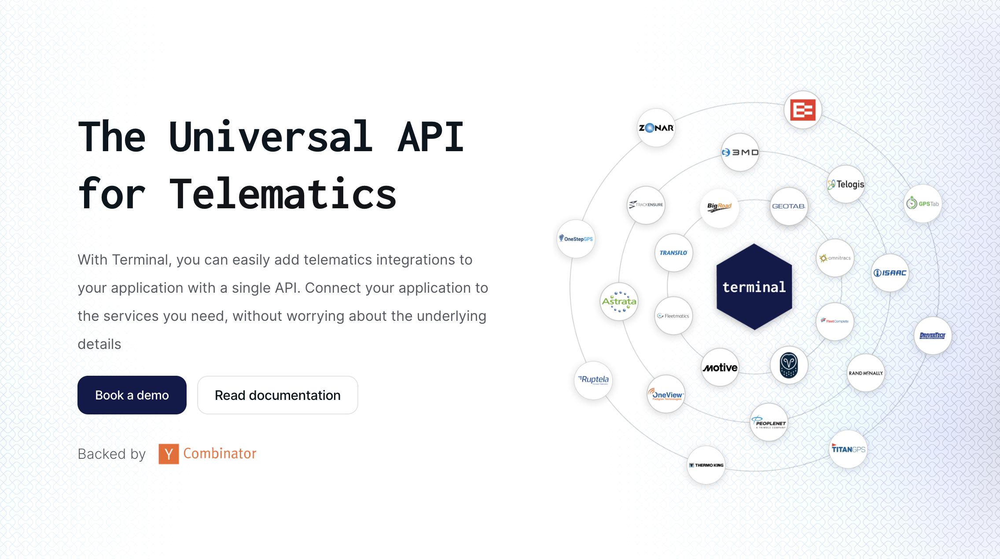

<div align="left">

[](https://withterminal.com)

# Terminal<a id="terminal"></a>

Terminal is a unified API that makes it easy to integrate with the leading telematics service providers.

Contact Support:
 Name: Terminal
 Email: connect@withterminal.com


</div>

## Table of Contents<a id="table-of-contents"></a>

<!-- toc -->

- [Requirements](#requirements)
- [Installation](#installation)
- [Getting Started](#getting-started)
- [Async](#async)
- [Raw HTTP Response](#raw-http-response)
- [Reference](#reference)
  * [`terminal.authentication.exchange_token`](#terminalauthenticationexchange_token)
  * [`terminal.connections.create_custom_connection`](#terminalconnectionscreate_custom_connection)
  * [`terminal.connections.get_current_details`](#terminalconnectionsget_current_details)
  * [`terminal.connections.list_all`](#terminalconnectionslist_all)
  * [`terminal.connections.update_current_connection_details`](#terminalconnectionsupdate_current_connection_details)
  * [`terminal.data_management.get_sync_status`](#terminaldata_managementget_sync_status)
  * [`terminal.data_management.list_sync_history`](#terminaldata_managementlist_sync_history)
  * [`terminal.data_management.make_passthrough_request`](#terminaldata_managementmake_passthrough_request)
  * [`terminal.data_management.request_sync_manual`](#terminaldata_managementrequest_sync_manual)
  * [`terminal.drivers.get_details`](#terminaldriversget_details)
  * [`terminal.drivers.list`](#terminaldriverslist)
  * [`terminal.groups.get_all_groups`](#terminalgroupsget_all_groups)
  * [`terminal.hours_of_service.get_available_time`](#terminalhours_of_serviceget_available_time)
  * [`terminal.hours_of_service.get_daily_logs`](#terminalhours_of_serviceget_daily_logs)
  * [`terminal.hours_of_service.list_hos_logs`](#terminalhours_of_servicelist_hos_logs)
  * [`terminal.ifta.get_monthly_reports`](#terminaliftaget_monthly_reports)
  * [`terminal.issues.list_observed_events`](#terminalissueslist_observed_events)
  * [`terminal.issues.mark_resolved`](#terminalissuesmark_resolved)
  * [`terminal.providers.get_list`](#terminalprovidersget_list)
  * [`terminal.safety.get_events`](#terminalsafetyget_events)
  * [`terminal.trailers.get_all_trailers`](#terminaltrailersget_all_trailers)
  * [`terminal.trailers.list_latest_locations`](#terminaltrailerslist_latest_locations)
  * [`terminal.trips.get_all_trips`](#terminaltripsget_all_trips)
  * [`terminal.vehicles.get_all`](#terminalvehiclesget_all)
  * [`terminal.vehicles.get_details`](#terminalvehiclesget_details)
  * [`terminal.vehicles.get_historical_stats`](#terminalvehiclesget_historical_stats)
  * [`terminal.vehicles.get_latest_locations`](#terminalvehiclesget_latest_locations)
  * [`terminal.vehicles.list_historical_locations`](#terminalvehicleslist_historical_locations)

<!-- tocstop -->

## Requirements<a id="requirements"></a>

Python >=3.7

## Installation<a id="installation"></a>
<div align="center">
  <a href="https://konfigthis.com/sdk-sign-up?company=Terminal&language=Python">
    
  </a>
</div>

## Getting Started<a id="getting-started"></a>

```python
from pprint import pprint
from terminal_python_sdk import Terminal, ApiException

terminal = Terminal(access_token="YOUR_BEARER_TOKEN")

try:
    # Public Token Exchange
    terminal.authentication.exchange_token(
        public_token="INSERT_PUBLIC_TOKEN",
    )
except ApiException as e:
    print("Exception when calling AuthenticationApi.exchange_token: %s\n" % e)
    pprint(e.body)
    pprint(e.headers)
    pprint(e.status)
    pprint(e.reason)
    pprint(e.round_trip_time)
```

## Async<a id="async"></a>

`async` support is available by prepending `a` to any method.

```python
import asyncio
from pprint import pprint
from terminal_python_sdk import Terminal, ApiException

terminal = Terminal(access_token="YOUR_BEARER_TOKEN")


async def main():
    try:
        # Public Token Exchange
        await terminal.authentication.aexchange_token(
            public_token="INSERT_PUBLIC_TOKEN",
        )
    except ApiException as e:
        print("Exception when calling AuthenticationApi.exchange_token: %s\n" % e)
        pprint(e.body)
        pprint(e.headers)
        pprint(e.status)
        pprint(e.reason)
        pprint(e.round_trip_time)


asyncio.run(main())
```

## Raw HTTP Response<a id="raw-http-response"></a>

To access raw HTTP response values, use the `.raw` namespace.

```python
from pprint import pprint
from terminal_python_sdk import Terminal, ApiException

terminal = Terminal(access_token="YOUR_BEARER_TOKEN")

try:
    # Public Token Exchange
    exchange_token_response = terminal.authentication.raw.exchange_token(
        public_token="INSERT_PUBLIC_TOKEN",
    )
    pprint(exchange_token_response.headers)
    pprint(exchange_token_response.status)
    pprint(exchange_token_response.round_trip_time)
except ApiException as e:
    print("Exception when calling AuthenticationApi.exchange_token: %s\n" % e)
    pprint(e.body)
    pprint(e.headers)
    pprint(e.status)
    pprint(e.reason)
    pprint(e.round_trip_time)
```


## Reference<a id="reference"></a>
### `terminal.authentication.exchange_token`<a id="terminalauthenticationexchange_token"></a>

Exchange the `publicToken` returned by our hosted authentication flow for a long lived connection token that will be used when requesting data from a customer's TSP.

#### 🛠️ Usage<a id="🛠️-usage"></a>

```python
terminal.authentication.exchange_token(
    public_token="INSERT_PUBLIC_TOKEN",
)
```

#### ⚙️ Parameters<a id="⚙️-parameters"></a>

##### public_token: `str`<a id="public_token-str"></a>

#### ⚙️ Request Body<a id="⚙️-request-body"></a>

[`AuthenticationExchangeTokenRequest`](./terminal_python_sdk/type/authentication_exchange_token_request.py)
#### 🌐 Endpoint<a id="🌐-endpoint"></a>

`/public-token/exchange` `post`

[🔙 **Back to Table of Contents**](#table-of-contents)

---

### `terminal.connections.create_custom_connection`<a id="terminalconnectionscreate_custom_connection"></a>

Create a new connection via API. This endpoint can be used to provide a completely custom connection creation experience for your customers.

For most use cases we recommend using the [Link UI](./rhuaxk9205cn8-link-component) to create connections.

#### 🛠️ Usage<a id="🛠️-usage"></a>

```python
terminal.connections.create_custom_connection(
    tags=["Tag Name", "Tag Name"],
    backfill={
        "days": 4.589623110260823e7,
        "start_from": "2021-01-06T03:24:53.000Z",
    },
    company={
        "dot_numbers": [
            "tempor ea cupidatat incididunt proident",
            "cupidatat occaecat do enim",
        ],
        "name": "minim nostrud",
    },
    credentials={
        "database": "amet ut laborum est",
        "password": "esse ut nostrud",
        "username": "nisi in culpa",
    },
    external_id="ullamco dolore ipsum",
    provider="geotab",
    sync_mode="automatic",
)
```

#### ⚙️ Parameters<a id="⚙️-parameters"></a>

##### tags: [`ConnectionsCreateCustomConnectionRequestTags`](./terminal_python_sdk/type/connections_create_custom_connection_request_tags.py)<a id="tags-connectionscreatecustomconnectionrequesttagsterminal_python_sdktypeconnections_create_custom_connection_request_tagspy"></a>

##### backfill: [`ConnectionsCreateCustomConnectionRequestBackfill`](./terminal_python_sdk/type/connections_create_custom_connection_request_backfill.py)<a id="backfill-connectionscreatecustomconnectionrequestbackfillterminal_python_sdktypeconnections_create_custom_connection_request_backfillpy"></a>


##### company: [`ConnectionsCreateCustomConnectionRequestCompany`](./terminal_python_sdk/type/connections_create_custom_connection_request_company.py)<a id="company-connectionscreatecustomconnectionrequestcompanyterminal_python_sdktypeconnections_create_custom_connection_request_companypy"></a>


##### credentials: [`ConnectionsCreateCustomConnectionRequestCredentials`](./terminal_python_sdk/type/connections_create_custom_connection_request_credentials.py)<a id="credentials-connectionscreatecustomconnectionrequestcredentialsterminal_python_sdktypeconnections_create_custom_connection_request_credentialspy"></a>


##### external_id: `str`<a id="external_id-str"></a>

##### provider: `str`<a id="provider-str"></a>

##### sync_mode: `str`<a id="sync_mode-str"></a>

#### ⚙️ Request Body<a id="⚙️-request-body"></a>

[`ConnectionsCreateCustomConnectionRequest`](./terminal_python_sdk/type/connections_create_custom_connection_request.py)
#### 🌐 Endpoint<a id="🌐-endpoint"></a>

`/connections` `post`

[🔙 **Back to Table of Contents**](#table-of-contents)

---

### `terminal.connections.get_current_details`<a id="terminalconnectionsget_current_details"></a>

Get the details of the current active connection. The current connection is derived from the provided connection token.

#### 🛠️ Usage<a id="🛠️-usage"></a>

```python
terminal.connections.get_current_details(
    connection_token="{{connectionToken}}",
)
```

#### ⚙️ Parameters<a id="⚙️-parameters"></a>

##### connection_token: `str`<a id="connection_token-str"></a>

(Required) The token returned when a user authenticated their account. This authorizes access to a specific account.

#### 🌐 Endpoint<a id="🌐-endpoint"></a>

`/connections/current` `get`

[🔙 **Back to Table of Contents**](#table-of-contents)

---

### `terminal.connections.list_all`<a id="terminalconnectionslist_all"></a>

List all of the connections you have for your application. Connections represent the authenticated access you have to your customer's TSP data.

#### 🛠️ Usage<a id="🛠️-usage"></a>

```python
terminal.connections.list_all(
    cursor="{{nextCursor}}",
    limit="1",
    external_id="123",
    dot_number="123",
    tag="tempor in aliqua",
)
```

#### ⚙️ Parameters<a id="⚙️-parameters"></a>

##### cursor: `str`<a id="cursor-str"></a>

Pagination cursor to start requests from

##### limit: `str`<a id="limit-str"></a>

The maximum number of results to return in a page.

##### external_id: `str`<a id="external_id-str"></a>

##### dot_number: `str`<a id="dot_number-str"></a>

##### tag: `str`<a id="tag-str"></a>

Filter connections by tag

#### 🌐 Endpoint<a id="🌐-endpoint"></a>

`/connections` `get`

[🔙 **Back to Table of Contents**](#table-of-contents)

---

### `terminal.connections.update_current_connection_details`<a id="terminalconnectionsupdate_current_connection_details"></a>

Update the details of the current active connection. The current connection is derived from the provided connection token.

#### 🛠️ Usage<a id="🛠️-usage"></a>

```python
terminal.connections.update_current_connection_details(
    tags=["dolor in magna", "reprehenderit dolor nostrud"],
    company={
        "name": "Acme Inc.",
    },
    external_id="ad sed dolore cupidatat",
    status="laborum sed consectetur",
    sync_mode="automatic",
    connection_token="{{connectionToken}}",
)
```

#### ⚙️ Parameters<a id="⚙️-parameters"></a>

##### tags: [`ConnectionsUpdateCurrentConnectionDetailsRequestTags`](./terminal_python_sdk/type/connections_update_current_connection_details_request_tags.py)<a id="tags-connectionsupdatecurrentconnectiondetailsrequesttagsterminal_python_sdktypeconnections_update_current_connection_details_request_tagspy"></a>

##### company: [`ConnectionsUpdateCurrentConnectionDetailsRequestCompany`](./terminal_python_sdk/type/connections_update_current_connection_details_request_company.py)<a id="company-connectionsupdatecurrentconnectiondetailsrequestcompanyterminal_python_sdktypeconnections_update_current_connection_details_request_companypy"></a>


##### external_id: `str`<a id="external_id-str"></a>

##### status: `str`<a id="status-str"></a>

##### sync_mode: `str`<a id="sync_mode-str"></a>

##### connection_token: `str`<a id="connection_token-str"></a>

(Required) The token returned when a user authenticated their account. This authorizes access to a specific account.

#### ⚙️ Request Body<a id="⚙️-request-body"></a>

[`ConnectionsUpdateCurrentConnectionDetailsRequest`](./terminal_python_sdk/type/connections_update_current_connection_details_request.py)
#### 🌐 Endpoint<a id="🌐-endpoint"></a>

`/connections/current` `patch`

[🔙 **Back to Table of Contents**](#table-of-contents)

---

### `terminal.data_management.get_sync_status`<a id="terminaldata_managementget_sync_status"></a>

Get the status of a sync job by ID.

#### 🛠️ Usage<a id="🛠️-usage"></a>

```python
terminal.data_management.get_sync_status(
    id="{{syncId}}",
    expand="",
    connection_token="{{connectionToken}}",
)
```

#### ⚙️ Parameters<a id="⚙️-parameters"></a>

##### id: `str`<a id="id-str"></a>

(Required) 

##### expand: `str`<a id="expand-str"></a>

Expand related resources in the response to reduce requests.

##### connection_token: `str`<a id="connection_token-str"></a>

(Required) The token returned when a user authenticated their account. This authorizes access to a specific account.

#### 🌐 Endpoint<a id="🌐-endpoint"></a>

`/syncs/{id}` `get`

[🔙 **Back to Table of Contents**](#table-of-contents)

---

### `terminal.data_management.list_sync_history`<a id="terminaldata_managementlist_sync_history"></a>

List a log of all batch sync jobs for the current connection.

#### 🛠️ Usage<a id="🛠️-usage"></a>

```python
terminal.data_management.list_sync_history(
    limit="1",
    cursor="{{nextCursor}}",
    status="in_progress",
    expand="",
    connection_token="{{connectionToken}}",
)
```

#### ⚙️ Parameters<a id="⚙️-parameters"></a>

##### limit: `str`<a id="limit-str"></a>

The maximum number of results to return in a page.

##### cursor: `str`<a id="cursor-str"></a>

Pagination cursor to start requests from

##### status: `str`<a id="status-str"></a>

##### expand: `str`<a id="expand-str"></a>

Expand related resources in the response to reduce requests.

##### connection_token: `str`<a id="connection_token-str"></a>

(Required) The token returned when a user authenticated their account. This authorizes access to a specific account.

#### 🌐 Endpoint<a id="🌐-endpoint"></a>

`/syncs` `get`

[🔙 **Back to Table of Contents**](#table-of-contents)

---

### `terminal.data_management.make_passthrough_request`<a id="terminaldata_managementmake_passthrough_request"></a>

Make an authenticated request to the underlying telematics provider. 

This endpoint helps ensure that you are never limited by Terminal. You can use passthrough requests to access capabilities that may be limited to a specific TSP or not yet in the normalized model.

Our team is here an ready to support custom use cases that may need `/passthrough`

#### 🛠️ Usage<a id="🛠️-usage"></a>

```python
terminal.data_management.make_passthrough_request(
    body='{"reportId":"1234"}',
    headers={},
    method="POST",
    path="/reports",
    connection_token="{{connectionToken}}",
)
```

#### ⚙️ Parameters<a id="⚙️-parameters"></a>

##### body: `str`<a id="body-str"></a>

##### headers: `Dict[str, Union[bool, date, datetime, dict, float, int, list, str, None]]`<a id="headers-dictstr-unionbool-date-datetime-dict-float-int-list-str-none"></a>

##### method: `str`<a id="method-str"></a>

##### path: `str`<a id="path-str"></a>

##### connection_token: `str`<a id="connection_token-str"></a>

(Required) The token returned when a user authenticated their account. This authorizes access to a specific account.

#### ⚙️ Request Body<a id="⚙️-request-body"></a>

[`DataManagementMakePassthroughRequestRequest`](./terminal_python_sdk/type/data_management_make_passthrough_request_request.py)
#### 🌐 Endpoint<a id="🌐-endpoint"></a>

`/passthrough` `post`

[🔙 **Back to Table of Contents**](#table-of-contents)

---

### `terminal.data_management.request_sync_manual`<a id="terminaldata_managementrequest_sync_manual"></a>

Manually request to sync the current connections data.

By default, Terminal will sync all connections where `syncMode = automatic` on a regular cadence. For customers that may not need a fleet's data to be kept up to date and want to reduce their active tracked trucks, you can set `syncMode = manual` and invoke this endpoint when you want to sync data.

If you're wondering if this is relevent to your use case then feel free to reach out and we'd be happy to assist.

#### 🛠️ Usage<a id="🛠️-usage"></a>

```python
terminal.data_management.request_sync_manual(
    days=7,
    connection_token="{{connectionToken}}",
)
```

#### ⚙️ Parameters<a id="⚙️-parameters"></a>

##### days: `Union[int, float]`<a id="days-unionint-float"></a>

##### connection_token: `str`<a id="connection_token-str"></a>

(Required) The token returned when a user authenticated their account. This authorizes access to a specific account.

#### ⚙️ Request Body<a id="⚙️-request-body"></a>

[`DataManagementRequestSyncManualRequest`](./terminal_python_sdk/type/data_management_request_sync_manual_request.py)
#### 🌐 Endpoint<a id="🌐-endpoint"></a>

`/syncs` `post`

[🔙 **Back to Table of Contents**](#table-of-contents)

---

### `terminal.drivers.get_details`<a id="terminaldriversget_details"></a>

Get the details of a specific driver

#### 🛠️ Usage<a id="🛠️-usage"></a>

```python
terminal.drivers.get_details(
    id="{{driverId}}",
    raw="true",
    expand="",
    connection_token="{{connectionToken}}",
)
```

#### ⚙️ Parameters<a id="⚙️-parameters"></a>

##### id: `str`<a id="id-str"></a>

(Required) 

##### raw: `str`<a id="raw-str"></a>

Include raw responses used to normalize model. Used for debugging or accessing unique properties that are not unified.

##### expand: `str`<a id="expand-str"></a>

Expand resources in the returned response

##### connection_token: `str`<a id="connection_token-str"></a>

(Required) The token returned when a user authenticated their account. This authorizes access to a specific account.

#### 🌐 Endpoint<a id="🌐-endpoint"></a>

`/drivers/{id}` `get`

[🔙 **Back to Table of Contents**](#table-of-contents)

---

### `terminal.drivers.list`<a id="terminaldriverslist"></a>

List all of the drivers in the connected account

#### 🛠️ Usage<a id="🛠️-usage"></a>

```python
terminal.drivers.list(
    cursor="{{nextCursor}}",
    limit="1",
    modified_after="2021-01-06T03:24:53.000Z",
    modified_before="2021-01-06T03:24:53.000Z",
    raw="true",
    expand="",
    connection_token="{{connectionToken}}",
)
```

#### ⚙️ Parameters<a id="⚙️-parameters"></a>

##### cursor: `str`<a id="cursor-str"></a>

Pagination cursor to start requests from

##### limit: `str`<a id="limit-str"></a>

The maximum number of results to return in a page.

##### modified_after: `str`<a id="modified_after-str"></a>

Only include records that were last modified after a provided date.

##### modified_before: `str`<a id="modified_before-str"></a>

Only include records that were last modified before a provided date.

##### raw: `str`<a id="raw-str"></a>

Include raw responses used to normalize model. Used for debugging or accessing unique properties that are not unified.

##### expand: `str`<a id="expand-str"></a>

Expand resources in the returned response

##### connection_token: `str`<a id="connection_token-str"></a>

(Required) The token returned when a user authenticated their account. This authorizes access to a specific account.

#### 🌐 Endpoint<a id="🌐-endpoint"></a>

`/drivers` `get`

[🔙 **Back to Table of Contents**](#table-of-contents)

---

### `terminal.groups.get_all_groups`<a id="terminalgroupsget_all_groups"></a>

List Groups

#### 🛠️ Usage<a id="🛠️-usage"></a>

```python
terminal.groups.get_all_groups(
    limit="1",
    cursor="{{nextCursor}}",
    expand="",
    raw="true",
    modified_after="2021-01-06T03:24:53.000Z",
    modified_before="2021-01-06T03:24:53.000Z",
    connection_token="{{connectionToken}}",
)
```

#### ⚙️ Parameters<a id="⚙️-parameters"></a>

##### limit: `str`<a id="limit-str"></a>

The maximum number of results to return in a page.

##### cursor: `str`<a id="cursor-str"></a>

Pagination cursor to start requests from

##### expand: `str`<a id="expand-str"></a>

Expand resources in the returned response

##### raw: `str`<a id="raw-str"></a>

Include raw responses used to normalize model. Used for debugging or accessing unique properties that are not unified.

##### modified_after: `str`<a id="modified_after-str"></a>

Only include records that were last modified after a provided date.

##### modified_before: `str`<a id="modified_before-str"></a>

Only include records that were last modified before a provided date.

##### connection_token: `str`<a id="connection_token-str"></a>

(Required) The token returned when a user authenticated their account. This authorizes access to a specific account.

#### 🌐 Endpoint<a id="🌐-endpoint"></a>

`/groups` `get`

[🔙 **Back to Table of Contents**](#table-of-contents)

---

### `terminal.hours_of_service.get_available_time`<a id="terminalhours_of_serviceget_available_time"></a>

List available time for the driver. This endpoint provides live access to the driver's available time. Different than most endpoints, this endpoint calls the provider's API in real time to get the latest available time for the driver. This endpoint is useful for building real time applications that need to know the driver's available time.

#### 🛠️ Usage<a id="🛠️-usage"></a>

```python
terminal.hours_of_service.get_available_time(
    cursor="{{nextCursor}}",
    limit="1",
    driver_ids="{{driverId}}",
    expand="",
    raw="true",
    connection_token="{{connectionToken}}",
)
```

#### ⚙️ Parameters<a id="⚙️-parameters"></a>

##### cursor: `str`<a id="cursor-str"></a>

Pagination cursor to start requests from

##### limit: `str`<a id="limit-str"></a>

The maximum number of results to return in a page.

##### driver_ids: `str`<a id="driver_ids-str"></a>

Comma separated list of driver IDs to filter for

##### expand: `str`<a id="expand-str"></a>

Expand resources in the returned response

##### raw: `str`<a id="raw-str"></a>

Include raw responses used to normalize model. Used for debugging or accessing unique properties that are not unified.

##### connection_token: `str`<a id="connection_token-str"></a>

(Required) The token returned when a user authenticated their account. This authorizes access to a specific account.

#### 🌐 Endpoint<a id="🌐-endpoint"></a>

`/hos/available-time` `get`

[🔙 **Back to Table of Contents**](#table-of-contents)

---

### `terminal.hours_of_service.get_daily_logs`<a id="terminalhours_of_serviceget_daily_logs"></a>

List daily summary of hours of service. Each daily log represents the time a driver spent in each duty status for a given day.

#### 🛠️ Usage<a id="🛠️-usage"></a>

```python
terminal.hours_of_service.get_daily_logs(
    cursor="{{nextCursor}}",
    limit="1",
    start_date="1995-04-25",
    end_date="1995-04-25",
    modified_after="2021-01-06T03:24:53.000Z",
    modified_before="2021-01-06T03:24:53.000Z",
    driver_ids="{{driverId}}",
    raw="true",
    expand="",
    connection_token="{{connectionToken}}",
)
```

#### ⚙️ Parameters<a id="⚙️-parameters"></a>

##### cursor: `str`<a id="cursor-str"></a>

Pagination cursor to start requests from

##### limit: `str`<a id="limit-str"></a>

The maximum number of results to return in a page.

##### start_date: `str`<a id="start_date-str"></a>

Only include daily logs from on or after a specific date

##### end_date: `str`<a id="end_date-str"></a>

Only include daily logs from on or before a specific date

##### modified_after: `str`<a id="modified_after-str"></a>

Only include records that were last modified after a provided date.

##### modified_before: `str`<a id="modified_before-str"></a>

Only include records that were last modified before a provided date.

##### driver_ids: `str`<a id="driver_ids-str"></a>

Comma separated list of driver IDs to filter for

##### raw: `str`<a id="raw-str"></a>

Include raw responses used to normalize model. Used for debugging or accessing unique properties that are not unified.

##### expand: `str`<a id="expand-str"></a>

Expand resources in the returned response

##### connection_token: `str`<a id="connection_token-str"></a>

(Required) The token returned when a user authenticated their account. This authorizes access to a specific account.

#### 🌐 Endpoint<a id="🌐-endpoint"></a>

`/hos/daily-logs` `get`

[🔙 **Back to Table of Contents**](#table-of-contents)

---

### `terminal.hours_of_service.list_hos_logs`<a id="terminalhours_of_servicelist_hos_logs"></a>

List all hours of service logs. Currently, HOS logs are tracked as the distinct changes in duty status. In the future we will be offering endpoints to expose current HOS status and historical daily summaries.

#### 🛠️ Usage<a id="🛠️-usage"></a>

```python
terminal.hours_of_service.list_hos_logs(
    cursor="{{nextCursor}}",
    limit="1",
    started_after="2021-01-06T03:24:53.000Z",
    started_before="2021-01-06T03:24:53.000Z",
    modified_after="2021-01-06T03:24:53.000Z",
    modified_before="2021-01-06T03:24:53.000Z",
    driver_ids="{{driverId}}",
    expand="",
    raw="true",
    connection_token="{{connectionToken}}",
)
```

#### ⚙️ Parameters<a id="⚙️-parameters"></a>

##### cursor: `str`<a id="cursor-str"></a>

Pagination cursor to start requests from

##### limit: `str`<a id="limit-str"></a>

The maximum number of results to return in a page.

##### started_after: `str`<a id="started_after-str"></a>

Only include records of statuses that started after a provided date.

##### started_before: `str`<a id="started_before-str"></a>

Only include records of statuses that started before a provided date.

##### modified_after: `str`<a id="modified_after-str"></a>

Only include records that were last modified after a provided date.

##### modified_before: `str`<a id="modified_before-str"></a>

Only include records that were last modified before a provided date.

##### driver_ids: `str`<a id="driver_ids-str"></a>

Comma separated list of driver IDs to filter for

##### expand: `str`<a id="expand-str"></a>

Expand resources in the returned response

##### raw: `str`<a id="raw-str"></a>

Include raw responses used to normalize model. Used for debugging or accessing unique properties that are not unified.

##### connection_token: `str`<a id="connection_token-str"></a>

(Required) The token returned when a user authenticated their account. This authorizes access to a specific account.

#### 🌐 Endpoint<a id="🌐-endpoint"></a>

`/hos/logs` `get`

[🔙 **Back to Table of Contents**](#table-of-contents)

---

### `terminal.ifta.get_monthly_reports`<a id="terminaliftaget_monthly_reports"></a>

Get all vehicle IFTA reports for the requested time span.

Currently can only increment by full months. 

_Note:_ data may change for a few days after the month. We will continue to update those reports to ensure you get accurate results.

#### 🛠️ Usage<a id="🛠️-usage"></a>

```python
terminal.ifta.get_monthly_reports(
    cursor="{{nextCursor}}",
    expand="",
    raw="true",
    start_month="2021-01",
    end_month="2021-01",
    group_by="vehicle,jurisdiction",
    connection_token="{{connectionToken}}",
)
```

#### ⚙️ Parameters<a id="⚙️-parameters"></a>

##### cursor: `str`<a id="cursor-str"></a>

Pagination cursor to start requests from

##### expand: `str`<a id="expand-str"></a>

Expand resources in the returned response

##### raw: `str`<a id="raw-str"></a>

Include raw responses used to normalize model. Used for debugging or accessing unique properties that are not unified.

##### start_month: `str`<a id="start_month-str"></a>

(Required) The month from which to start including vehicle reports

##### end_month: `str`<a id="end_month-str"></a>

(Required) Include vehicle reports up to and including this month

##### group_by: `str`<a id="group_by-str"></a>

Computes the total distance traversed within a specified month range, with the results grouped by either jurisdiction, vehicle, or both. If no grouping parameter is provided, the default grouping is `vehicle,jurisdiction`.

##### connection_token: `str`<a id="connection_token-str"></a>

(Required) The token returned when a user authenticated their account. This authorizes access to a specific account.

#### 🌐 Endpoint<a id="🌐-endpoint"></a>

`/ifta/summary` `get`

[🔙 **Back to Table of Contents**](#table-of-contents)

---

### `terminal.issues.list_observed_events`<a id="terminalissueslist_observed_events"></a>

List all issues that have been observed by Terminal.
Issues are generated when we observe something that may impact the completeness or accuracy of the data we provide but do not justify a full error.
For example, if we lack permissions for a specific resource or need to skip an item due to invalid data.

#### 🛠️ Usage<a id="🛠️-usage"></a>

```python
terminal.issues.list_observed_events(
    limit="1",
    cursor="{{nextCursor}}",
    last_reported_after="2023-06-07",
    last_reported_before="2023-06-07",
    expand="",
    connection_id="conn_01GV12VR4DJP70GD1ZBK0SDWFH",
    error_code="invalid_source_id",
    status="ongoing",
)
```

#### ⚙️ Parameters<a id="⚙️-parameters"></a>

##### limit: `str`<a id="limit-str"></a>

The maximum number of results to return in a page.

##### cursor: `str`<a id="cursor-str"></a>

Pagination cursor to start requests from

##### last_reported_after: `str`<a id="last_reported_after-str"></a>

Timestamp to start when the issue was last observed

##### last_reported_before: `str`<a id="last_reported_before-str"></a>

Timestamp to end when the issue was last observed

##### expand: `str`<a id="expand-str"></a>

Expand related resources to see all details

##### connection_id: `str`<a id="connection_id-str"></a>

Filter issues to a specific connection

##### error_code: `str`<a id="error_code-str"></a>

Filter issues to a specific error code

##### status: `str`<a id="status-str"></a>

Filter issues to a specific status

#### 🌐 Endpoint<a id="🌐-endpoint"></a>

`/issues` `get`

[🔙 **Back to Table of Contents**](#table-of-contents)

---

### `terminal.issues.mark_resolved`<a id="terminalissuesmark_resolved"></a>

Mark an issue's status as `resolved` until the issue is observed again.

#### 🛠️ Usage<a id="🛠️-usage"></a>

```python
terminal.issues.mark_resolved(
    issue_id="tempor in aliqua",
)
```

#### ⚙️ Parameters<a id="⚙️-parameters"></a>

##### issue_id: `str`<a id="issue_id-str"></a>

(Required) 

#### ⚙️ Request Body<a id="⚙️-request-body"></a>

`Dict[str, Union[bool, date, datetime, dict, float, int, list, str, None]]`
#### 🌐 Endpoint<a id="🌐-endpoint"></a>

`/issues/{issueId}/resolve` `post`

[🔙 **Back to Table of Contents**](#table-of-contents)

---

### `terminal.providers.get_list`<a id="terminalprovidersget_list"></a>

Retrieve a list of the providers Terminal supports. This endpoint will grow to include additional details about the supported capabilities of each provider.

#### 🛠️ Usage<a id="🛠️-usage"></a>

```python
terminal.providers.get_list()
```

#### 🌐 Endpoint<a id="🌐-endpoint"></a>

`/providers` `get`

[🔙 **Back to Table of Contents**](#table-of-contents)

---

### `terminal.safety.get_events`<a id="terminalsafetyget_events"></a>

List all safety events detected by the provider.

#### 🛠️ Usage<a id="🛠️-usage"></a>

```python
terminal.safety.get_events(
    cursor="{{nextCursor}}",
    limit="1",
    modified_after="2021-01-06T03:24:53.000Z",
    modified_before="2021-01-06T03:24:53.000Z",
    started_after="2021-01-06T03:24:53.000Z",
    started_before="2021-01-06T03:24:53.000Z",
    driver_ids="{{driverId}}",
    vehicle_ids="{{vehicleId}}",
    expand="",
    raw="true",
    connection_token="{{connectionToken}}",
)
```

#### ⚙️ Parameters<a id="⚙️-parameters"></a>

##### cursor: `str`<a id="cursor-str"></a>

Pagination cursor to start requests from

##### limit: `str`<a id="limit-str"></a>

The maximum number of results to return in a page.

##### modified_after: `str`<a id="modified_after-str"></a>

Only include records that were last modified after a provided date.

##### modified_before: `str`<a id="modified_before-str"></a>

Only include records that were last modified before a provided date.

##### started_after: `str`<a id="started_after-str"></a>

Only include records of statuses that started after a provided date.

##### started_before: `str`<a id="started_before-str"></a>

Only include records of statuses that started before a provided date.

##### driver_ids: `str`<a id="driver_ids-str"></a>

Comma separated list of driver IDs to filter for

##### vehicle_ids: `str`<a id="vehicle_ids-str"></a>

Comma separated list of vehicle IDs to filter for

##### expand: `str`<a id="expand-str"></a>

Expand resources in the returned response

##### raw: `str`<a id="raw-str"></a>

Include raw responses used to normalize model. Used for debugging or accessing unique properties that are not unified.

##### connection_token: `str`<a id="connection_token-str"></a>

(Required) The token returned when a user authenticated their account. This authorizes access to a specific account.

#### 🌐 Endpoint<a id="🌐-endpoint"></a>

`/safety/events` `get`

[🔙 **Back to Table of Contents**](#table-of-contents)

---

### `terminal.trailers.get_all_trailers`<a id="terminaltrailersget_all_trailers"></a>

List Trailers

#### 🛠️ Usage<a id="🛠️-usage"></a>

```python
terminal.trailers.get_all_trailers(
    limit="1",
    cursor="{{nextCursor}}",
    expand="",
    raw="true",
    modified_after="2021-01-06T03:24:53.000Z",
    modified_before="2021-01-06T03:24:53.000Z",
    connection_token="{{connectionToken}}",
)
```

#### ⚙️ Parameters<a id="⚙️-parameters"></a>

##### limit: `str`<a id="limit-str"></a>

The maximum number of results to return in a page.

##### cursor: `str`<a id="cursor-str"></a>

Pagination cursor to start requests from

##### expand: `str`<a id="expand-str"></a>

Expand resources in the returned response

##### raw: `str`<a id="raw-str"></a>

Include raw responses used to normalize model. Used for debugging or accessing unique properties that are not unified.

##### modified_after: `str`<a id="modified_after-str"></a>

Only include records that were last modified after a provided date.

##### modified_before: `str`<a id="modified_before-str"></a>

Only include records that were last modified before a provided date.

##### connection_token: `str`<a id="connection_token-str"></a>

(Required) The token returned when a user authenticated their account. This authorizes access to a specific account.

#### 🌐 Endpoint<a id="🌐-endpoint"></a>

`/trailers` `get`

[🔙 **Back to Table of Contents**](#table-of-contents)

---

### `terminal.trailers.list_latest_locations`<a id="terminaltrailerslist_latest_locations"></a>

Latest Trailer Locations

#### 🛠️ Usage<a id="🛠️-usage"></a>

```python
terminal.trailers.list_latest_locations(
    limit="1",
    cursor="{{nextCursor}}",
    expand="",
    raw="true",
    connection_token="{{connectionToken}}",
)
```

#### ⚙️ Parameters<a id="⚙️-parameters"></a>

##### limit: `str`<a id="limit-str"></a>

The maximum number of results to return in a page.

##### cursor: `str`<a id="cursor-str"></a>

Pagination cursor to start requests from

##### expand: `str`<a id="expand-str"></a>

Expand resources in the returned response

##### raw: `str`<a id="raw-str"></a>

Include raw responses used to normalize model. Used for debugging or accessing unique properties that are not unified.

##### connection_token: `str`<a id="connection_token-str"></a>

(Required) The token returned when a user authenticated their account. This authorizes access to a specific account.

#### 🌐 Endpoint<a id="🌐-endpoint"></a>

`/trailers/locations` `get`

[🔙 **Back to Table of Contents**](#table-of-contents)

---

### `terminal.trips.get_all_trips`<a id="terminaltripsget_all_trips"></a>

List all trips in the connected account. Trips define a period of time where a vehicle is in motion.

#### 🛠️ Usage<a id="🛠️-usage"></a>

```python
terminal.trips.get_all_trips(
    cursor="{{nextCursor}}",
    limit="1",
    modified_after="2021-01-06T03:24:53.000Z",
    modified_before="2021-01-06T03:24:53.000Z",
    started_after="2021-01-06T03:24:53.000Z",
    started_before="2021-01-06T03:24:53.000Z",
    ended_after="2021-01-06T03:24:53.000Z",
    ended_before="2021-01-06T03:24:53.000Z",
    driver_ids="{{driverId}}",
    vehicle_ids="{{vehicleId}}",
    raw="true",
    expand="",
    connection_token="{{connectionToken}}",
)
```

#### ⚙️ Parameters<a id="⚙️-parameters"></a>

##### cursor: `str`<a id="cursor-str"></a>

Pagination cursor to start requests from

##### limit: `str`<a id="limit-str"></a>

The maximum number of results to return in a page.

##### modified_after: `str`<a id="modified_after-str"></a>

Only include records that were last modified after a provided date.

##### modified_before: `str`<a id="modified_before-str"></a>

Only include records that were last modified before a provided date.

##### started_after: `str`<a id="started_after-str"></a>

Only include trips that started after a provided date.

##### started_before: `str`<a id="started_before-str"></a>

Only include trips that started before a provided date.

##### ended_after: `str`<a id="ended_after-str"></a>

Only include trips that ended after a provided date.

##### ended_before: `str`<a id="ended_before-str"></a>

Only include trips that ended before a provided date.

##### driver_ids: `str`<a id="driver_ids-str"></a>

Comma separated list of driver IDs to filter for

##### vehicle_ids: `str`<a id="vehicle_ids-str"></a>

Comma separated list of vehicle IDs to filter for

##### raw: `str`<a id="raw-str"></a>

Include raw responses used to normalize model. Used for debugging or accessing unique properties that are not unified.

##### expand: `str`<a id="expand-str"></a>

Expand resources in the returned response

##### connection_token: `str`<a id="connection_token-str"></a>

(Required) The token returned when a user authenticated their account. This authorizes access to a specific account.

#### 🌐 Endpoint<a id="🌐-endpoint"></a>

`/trips` `get`

[🔙 **Back to Table of Contents**](#table-of-contents)

---

### `terminal.vehicles.get_all`<a id="terminalvehiclesget_all"></a>

List all of the vehicles in the connected account

#### 🛠️ Usage<a id="🛠️-usage"></a>

```python
terminal.vehicles.get_all(
    cursor="{{nextCursor}}",
    limit="1",
    modified_after="2021-01-06T03:24:53.000Z",
    modified_before="2021-01-06T03:24:53.000Z",
    raw="true",
    expand="",
    connection_token="{{connectionToken}}",
)
```

#### ⚙️ Parameters<a id="⚙️-parameters"></a>

##### cursor: `str`<a id="cursor-str"></a>

Pagination cursor to start requests from

##### limit: `str`<a id="limit-str"></a>

The maximum number of results to return in a page.

##### modified_after: `str`<a id="modified_after-str"></a>

Only include records that were last modified after a provided date.

##### modified_before: `str`<a id="modified_before-str"></a>

Only include records that were last modified before a provided date.

##### raw: `str`<a id="raw-str"></a>

Include raw responses used to normalize model. Used for debugging or accessing unique properties that are not unified.

##### expand: `str`<a id="expand-str"></a>

Expand resources in the returned response

##### connection_token: `str`<a id="connection_token-str"></a>

(Required) The token returned when a user authenticated their account. This authorizes access to a specific account.

#### 🌐 Endpoint<a id="🌐-endpoint"></a>

`/vehicles` `get`

[🔙 **Back to Table of Contents**](#table-of-contents)

---

### `terminal.vehicles.get_details`<a id="terminalvehiclesget_details"></a>

Get the details of a specific vehicle

#### 🛠️ Usage<a id="🛠️-usage"></a>

```python
terminal.vehicles.get_details(
    id="{{vehicleId}}",
    raw="true",
    expand="",
    connection_token="{{connectionToken}}",
)
```

#### ⚙️ Parameters<a id="⚙️-parameters"></a>

##### id: `str`<a id="id-str"></a>

(Required) 

##### raw: `str`<a id="raw-str"></a>

Include raw responses used to normalize model. Used for debugging or accessing unique properties that are not unified.

##### expand: `str`<a id="expand-str"></a>

Expand resources in the returned response

##### connection_token: `str`<a id="connection_token-str"></a>

(Required) The token returned when a user authenticated their account. This authorizes access to a specific account.

#### 🌐 Endpoint<a id="🌐-endpoint"></a>

`/vehicles/{id}` `get`

[🔙 **Back to Table of Contents**](#table-of-contents)

---

### `terminal.vehicles.get_historical_stats`<a id="terminalvehiclesget_historical_stats"></a>

List historical stats and logs about the vehicle.

#### 🛠️ Usage<a id="🛠️-usage"></a>

```python
terminal.vehicles.get_historical_stats(
    vehicle_id="{{vehicleId}}",
    cursor="{{nextCursor}}",
    limit="1",
    expand="",
    start_at="2021-01-06T03:24:53.000Z",
    end_at="2021-01-06T03:24:53.000Z",
    types="odometer,engine_state,fuel_level,total_fuel_consumption",
    raw="true",
    connection_token="{{connectionToken}}",
)
```

#### ⚙️ Parameters<a id="⚙️-parameters"></a>

##### vehicle_id: `str`<a id="vehicle_id-str"></a>

(Required) 

##### cursor: `str`<a id="cursor-str"></a>

Pagination cursor to start requests from

##### limit: `str`<a id="limit-str"></a>

The maximum number of results to return in a page.

##### expand: `str`<a id="expand-str"></a>

Expand resources in the returned response

##### start_at: `str`<a id="start_at-str"></a>

Timestamp to start from - defaults to `TODAY - 1 MONTH`

##### end_at: `str`<a id="end_at-str"></a>

Timestamp to end at - defaults to `TODAY`

##### types: `str`<a id="types-str"></a>

Comma separated list of vehicle stats to filter for

##### raw: `str`<a id="raw-str"></a>

Include raw responses used to normalize model. Used for debugging or accessing unique properties that are not unified.

##### connection_token: `str`<a id="connection_token-str"></a>

(Required) The token returned when a user authenticated their account. This authorizes access to a specific account.

#### 🌐 Endpoint<a id="🌐-endpoint"></a>

`/vehicles/{vehicleId}/stats/historical` `get`

[🔙 **Back to Table of Contents**](#table-of-contents)

---

### `terminal.vehicles.get_latest_locations`<a id="terminalvehiclesget_latest_locations"></a>

List the latest location of the vehicles in the connected account.
This endpoint will call the provider's API in real time to get the latest location of the vehicle. 
_Please note: this endpoint will exclude vehicles that have no last known location._

#### 🛠️ Usage<a id="🛠️-usage"></a>

```python
terminal.vehicles.get_latest_locations(
    cursor="{{nextCursor}}",
    limit="1",
    raw="true",
    vehicle_ids="{{vehicleId}}",
    expand="",
    connection_token="{{connectionToken}}",
)
```

#### ⚙️ Parameters<a id="⚙️-parameters"></a>

##### cursor: `str`<a id="cursor-str"></a>

Pagination cursor to start requests from

##### limit: `str`<a id="limit-str"></a>

The maximum number of results to return in a page.

##### raw: `str`<a id="raw-str"></a>

Include raw responses used to normalize model. Used for debugging or accessing unique properties that are not unified.

##### vehicle_ids: `str`<a id="vehicle_ids-str"></a>

Comma separated list of vehicle IDs to filter for

##### expand: `str`<a id="expand-str"></a>

Expand resources in the returned response

##### connection_token: `str`<a id="connection_token-str"></a>

(Required) The token returned when a user authenticated their account. This authorizes access to a specific account.

#### 🌐 Endpoint<a id="🌐-endpoint"></a>

`/vehicles/locations` `get`

[🔙 **Back to Table of Contents**](#table-of-contents)

---

### `terminal.vehicles.list_historical_locations`<a id="terminalvehicleslist_historical_locations"></a>

List the historical breadcrumb locations for a vehicle.

_Note:_

Given the large volume of location data available, we encourage customers to accept compressed (`gzip`) responses in order to maximize throughput. This is supported with many popular HTTP clients. Result limits vary depending on if results are compressed or not.

#### 🛠️ Usage<a id="🛠️-usage"></a>

```python
terminal.vehicles.list_historical_locations(
    vehicle_id="{{vehicleId}}",
    cursor="{{nextCursor}}",
    limit="1",
    start_at="2021-01-06T03:24:53.000Z",
    end_at="2021-01-06T03:24:53.000Z",
    raw="true",
    connection_token="{{connectionToken}}",
)
```

#### ⚙️ Parameters<a id="⚙️-parameters"></a>

##### vehicle_id: `str`<a id="vehicle_id-str"></a>

(Required) Vehicle to retrieve breadcrumb locations for

##### cursor: `str`<a id="cursor-str"></a>

Pagination cursor to start requests from

##### limit: `str`<a id="limit-str"></a>

The maximum number of results to return in a page.

##### start_at: `str`<a id="start_at-str"></a>

Timestamp to start from - defaults to `TODAY - 1 MONTH`

##### end_at: `str`<a id="end_at-str"></a>

Timestamp to end at - defaults to `TODAY`

##### raw: `str`<a id="raw-str"></a>

Include raw responses used to normalize model. Used for debugging or accessing unique properties that are not unified.

##### connection_token: `str`<a id="connection_token-str"></a>

(Required) The token returned when a user authenticated their account. This authorizes access to a specific account.

#### 🌐 Endpoint<a id="🌐-endpoint"></a>

`/vehicles/{vehicleId}/locations` `get`

[🔙 **Back to Table of Contents**](#table-of-contents)

---


## Author<a id="author"></a>
This Python package is automatically generated by [Konfig](https://konfigthis.com)
